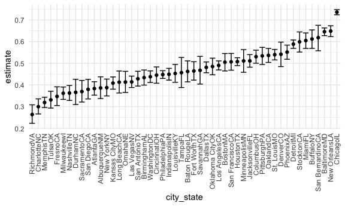

P8105\_hw5\_qc2307
================
Qixiang Chen
11/20/2021

``` r
library(tidyverse)
library(ggplot2)
library(p8105.datasets)
library(patchwork)
library(readxl)
library(httr)
```

``` r
knitr::opts_chunk$set(
  fig.width = 6,
  fig.asp = .6,
  out.width = "90%"
)
theme_set(theme_minimal() + theme(legend.position = "bottom"))
options(
  ggplot2.continuous.colour = "viridis",
  ggplot2.continuous.fill = "viridis"
)
scale_colour_discrete = scale_color_viridis_d
scale_fill_discrete = scale_fill_viridis_d
```

## Problem 1

``` r
homicide_df = 
  read.csv("./untitled folder/homicide-data.csv", na = c("", "Unknown")) %>%
  mutate(
    city_state = str_c(city, state),
    resolution = case_when(
      disposition == "Closed without arrest" ~ "unsolved",
      disposition == "Open/No arrest" ~ "unsolved",
      disposition == "Closed by arrest" ~ "solved"
    )
  ) %>%
  relocate(city_state) %>%
  filter(city_state != "TulsaAL")
```

focus on Baltimore.

``` r
baltimore_df = 
  homicide_df %>%
  filter(city_state == "BaltimoreMD")

baltimore_summary = 
  baltimore_df %>%
  summarize(
    unsolved = sum(resolution == "unsolved"),
    n = n()
  )

baltimore_test = 
  prop.test(
    x = baltimore_summary %>% pull(unsolved),
    n = baltimore_summary %>% pull(n)
  )
baltimore_test %>%
  broom::tidy()
```

    ## # A tibble: 1 × 8
    ##   estimate statistic  p.value parameter conf.low conf.high method    alternative
    ##      <dbl>     <dbl>    <dbl>     <int>    <dbl>     <dbl> <chr>     <chr>      
    ## 1    0.646      239. 6.46e-54         1    0.628     0.663 1-sample… two.sided

``` r
prop_test_function = function(city_df) {
  
  city_summary = 
    city_df %>%
    summarize(
      unsolved = sum(resolution == "unsolved"),
      n = n()
    )
  
  city_test = 
    prop.test(
      x = city_summary %>% pull(unsolved),
      n = city_summary %>% pull(n)
    )
  return(city_test)
}

prop_test_function(baltimore_df)
```

    ## 
    ##  1-sample proportions test with continuity correction
    ## 
    ## data:  city_summary %>% pull(unsolved) out of city_summary %>% pull(n), null probability 0.5
    ## X-squared = 239.01, df = 1, p-value < 2.2e-16
    ## alternative hypothesis: true p is not equal to 0.5
    ## 95 percent confidence interval:
    ##  0.6275625 0.6631599
    ## sample estimates:
    ##         p 
    ## 0.6455607

``` r
homicide_df %>%
  filter(city_state == "AlbuquerqueNM") %>%
  prop_test_function()
```

    ## 
    ##  1-sample proportions test with continuity correction
    ## 
    ## data:  city_summary %>% pull(unsolved) out of city_summary %>% pull(n), null probability 0.5
    ## X-squared = 19.114, df = 1, p-value = 1.232e-05
    ## alternative hypothesis: true p is not equal to 0.5
    ## 95 percent confidence interval:
    ##  0.3372604 0.4375766
    ## sample estimates:
    ##         p 
    ## 0.3862434

Iterate across all cities

``` r
results_df = 
  homicide_df %>%
  nest(data = uid:resolution) %>%
  mutate(
    test_results = map(data, prop_test_function),
    tidy_results = map(test_results, broom::tidy)
  ) %>%
  select(city_state, tidy_results) %>%
  unnest(tidy_results) %>%
  select(city_state, estimate, starts_with("conf"))
```

make a plot showing estimates and confidence intervals.

``` r
results_df %>% 
  mutate(city_state = fct_reorder(city_state, estimate)) %>% 
  ggplot(aes(x = city_state, y = estimate)) +
  geom_point() + 
  geom_errorbar(aes(ymin = conf.low, ymax = conf.high)) + 
  theme(axis.text.x = element_text(angle = 90, vjust = 0.5, hjust = 1))
```



``` r
homicide_df %>%
  group_by(city_state) %>%
  summarize(
    unsolved = sum(resolution == "unsolve"),
    n = n()
  ) %>%
  mutate(
    test_results = map2(unsolved, n, prop.test),
    tidy_results = map(test_results, broom::tidy)
  ) %>%
  select(city_state, tidy_results) %>%
  unnest(tidy_results) %>%
  select(city_state, estimate, starts_with("conf"))
```

    ## # A tibble: 50 × 4
    ##    city_state    estimate conf.low conf.high
    ##    <chr>            <dbl>    <dbl>     <dbl>
    ##  1 AlbuquerqueNM        0        0  0.0125  
    ##  2 AtlantaGA            0        0  0.00490 
    ##  3 BaltimoreMD          0        0  0.00169 
    ##  4 Baton RougeLA        0        0  0.0112  
    ##  5 BirminghamAL         0        0  0.00596 
    ##  6 BostonMA             0        0  0.00775 
    ##  7 BuffaloNY            0        0  0.00912 
    ##  8 CharlotteNC          0        0  0.00693 
    ##  9 ChicagoIL            0        0  0.000865
    ## 10 CincinnatiOH         0        0  0.00686 
    ## # … with 40 more rows

## Problem 2

#### Step1: create a dataframe containing all files names.

``` r
file_name = tibble(
  files = list.files("./untitled folder/data")
)
file_name
```

    ## # A tibble: 20 × 1
    ##    files     
    ##    <chr>     
    ##  1 con_01.csv
    ##  2 con_02.csv
    ##  3 con_03.csv
    ##  4 con_04.csv
    ##  5 con_05.csv
    ##  6 con_06.csv
    ##  7 con_07.csv
    ##  8 con_08.csv
    ##  9 con_09.csv
    ## 10 con_10.csv
    ## 11 exp_01.csv
    ## 12 exp_02.csv
    ## 13 exp_03.csv
    ## 14 exp_04.csv
    ## 15 exp_05.csv
    ## 16 exp_06.csv
    ## 17 exp_07.csv
    ## 18 exp_08.csv
    ## 19 exp_09.csv
    ## 20 exp_10.csv

#### Step2: Iterate over file names and read in data for each subject and saving the result as a new variable in the dataframe.

``` r
dataframe_new = 
  file_name %>%
  mutate(
    data = purrr::map(.x = str_c("./untitled folder/data/", files), ~ read_csv(.x))
    ) %>%
  unnest(data)

dataframe_new
```

    ## # A tibble: 20 × 9
    ##    files      week_1 week_2 week_3 week_4 week_5 week_6 week_7 week_8
    ##    <chr>       <dbl>  <dbl>  <dbl>  <dbl>  <dbl>  <dbl>  <dbl>  <dbl>
    ##  1 con_01.csv   0.2   -1.31   0.66   1.96   0.23   1.09   0.05   1.94
    ##  2 con_02.csv   1.13  -0.88   1.07   0.17  -0.83  -0.31   1.58   0.44
    ##  3 con_03.csv   1.77   3.11   2.22   3.26   3.31   0.89   1.88   1.01
    ##  4 con_04.csv   1.04   3.66   1.22   2.33   1.47   2.7    1.87   1.66
    ##  5 con_05.csv   0.47  -0.58  -0.09  -1.37  -0.32  -2.17   0.45   0.48
    ##  6 con_06.csv   2.37   2.5    1.59  -0.16   2.08   3.07   0.78   2.35
    ##  7 con_07.csv   0.03   1.21   1.13   0.64   0.49  -0.12  -0.07   0.46
    ##  8 con_08.csv  -0.08   1.42   0.09   0.36   1.18  -1.16   0.33  -0.44
    ##  9 con_09.csv   0.08   1.24   1.44   0.41   0.95   2.75   0.3    0.03
    ## 10 con_10.csv   2.14   1.15   2.52   3.44   4.26   0.97   2.73  -0.53
    ## 11 exp_01.csv   3.05   3.67   4.84   5.8    6.33   5.46   6.38   5.91
    ## 12 exp_02.csv  -0.84   2.63   1.64   2.58   1.24   2.32   3.11   3.78
    ## 13 exp_03.csv   2.15   2.08   1.82   2.84   3.36   3.61   3.37   3.74
    ## 14 exp_04.csv  -0.62   2.54   3.78   2.73   4.49   5.82   6      6.49
    ## 15 exp_05.csv   0.7    3.33   5.34   5.57   6.9    6.66   6.24   6.95
    ## 16 exp_06.csv   3.73   4.08   5.4    6.41   4.87   6.09   7.66   5.83
    ## 17 exp_07.csv   1.18   2.35   1.23   1.17   2.02   1.61   3.13   4.88
    ## 18 exp_08.csv   1.37   1.43   1.84   3.6    3.8    4.72   4.68   5.7 
    ## 19 exp_09.csv  -0.4    1.08   2.66   2.7    2.8    2.64   3.51   3.27
    ## 20 exp_10.csv   1.09   2.8    2.8    4.3    2.25   6.57   6.09   4.64

#### Step3: Tidy the result; manipulate file names to include control arm and subject ID, make sure weekly observations are “tidy”, and do any other tidying that’s necessary

``` r
dataframe_new = 
  dataframe_new %>%
  separate(files, into = c("arm", "subject_id", "csv")) %>%
  select(-csv) %>%
  pivot_longer(
    week_1:week_8,
    names_to = "week",
    names_prefix = "week_",
    values_to = "observations"
  ) %>%
  mutate(
    arm = recode(arm, "con" = "control", "exp" = "experimental")
  )

dataframe_new
```

    ## # A tibble: 160 × 4
    ##    arm     subject_id week  observations
    ##    <chr>   <chr>      <chr>        <dbl>
    ##  1 control 01         1             0.2 
    ##  2 control 01         2            -1.31
    ##  3 control 01         3             0.66
    ##  4 control 01         4             1.96
    ##  5 control 01         5             0.23
    ##  6 control 01         6             1.09
    ##  7 control 01         7             0.05
    ##  8 control 01         8             1.94
    ##  9 control 02         1             1.13
    ## 10 control 02         2            -0.88
    ## # … with 150 more rows

#### Step4: Make a spaghetti plot showing observations on each subject over time, and comment on differences between groups.

``` r
spaghetti_plot = 
  dataframe_new %>%
  ggplot(aes(x = week, y = observations, group = subject_id, color = subject_id)) + 
  geom_point(alpha = 0.3) + 
  geom_line() + 
  facet_grid(.~arm) + 
  theme(plot.title = element_text(hjust = 0.5)) +
  labs(
    tittle = "Observations on Each Subject Over Time",
    x = "Week",
    y = "Observation values"
  )

spaghetti_plot
```


Comment: In the two graphs, the graph for control group doesn’t have a
really clear trend between the independent variable, week, and dependent
variable, observation values. In the graph for experimental group, we
can observe that there is a generally positive trend between the
independent variable, week, and dependent variable, observation values.
In this plot, with the increase in week, generally there will be an
increase in observation values.

# Problem 3

#### Step1: The code chunk below loads the iris dataset from the tidyverse package

``` r
set.seed(10)

iris_with_missing = iris %>% 
  map_df(~replace(.x, sample(1:150, 20), NA)) %>%
  mutate(Species = as.character(Species)) %>%
  janitor::clean_names()

iris_with_missing
```

    ## # A tibble: 150 × 5
    ##    sepal_length sepal_width petal_length petal_width species
    ##           <dbl>       <dbl>        <dbl>       <dbl> <chr>  
    ##  1          5.1         3.5          1.4         0.2 setosa 
    ##  2          4.9         3            1.4         0.2 setosa 
    ##  3          4.7         3.2          1.3         0.2 setosa 
    ##  4          4.6         3.1          1.5        NA   setosa 
    ##  5          5           3.6          1.4         0.2 setosa 
    ##  6          5.4         3.9          1.7         0.4 setosa 
    ##  7         NA           3.4          1.4         0.3 setosa 
    ##  8          5           3.4          1.5         0.2 setosa 
    ##  9          4.4         2.9          1.4         0.2 setosa 
    ## 10          4.9         3.1         NA           0.1 setosa 
    ## # … with 140 more rows

#### Step2: Write a function to serve filling in the missing values

requirement1: For numeric variables, you should fill in missing values
with the mean of non-missing values. requirement2: For character
variables, you should fill in missing values with “virginica”.

``` r
filling_table = function(x) {
  if(is.numeric(x)) {
    replace_na(x, mean(x, na.rm = TRUE))
  }
  else if(is.character(x)) {
    x = replace_na(x, "virginica")
  }
}
```

#### Step3: Applying the function

``` r
iris_with_filled = map(iris_with_missing, filling_table) %>%
  as_tibble()

iris_with_filled
```

    ## # A tibble: 150 × 5
    ##    sepal_length sepal_width petal_length petal_width species
    ##           <dbl>       <dbl>        <dbl>       <dbl> <chr>  
    ##  1         5.1          3.5         1.4         0.2  setosa 
    ##  2         4.9          3           1.4         0.2  setosa 
    ##  3         4.7          3.2         1.3         0.2  setosa 
    ##  4         4.6          3.1         1.5         1.19 setosa 
    ##  5         5            3.6         1.4         0.2  setosa 
    ##  6         5.4          3.9         1.7         0.4  setosa 
    ##  7         5.82         3.4         1.4         0.3  setosa 
    ##  8         5            3.4         1.5         0.2  setosa 
    ##  9         4.4          2.9         1.4         0.2  setosa 
    ## 10         4.9          3.1         3.77        0.1  setosa 
    ## # … with 140 more rows
